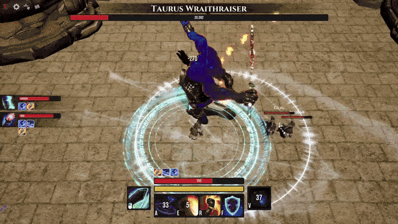

A game made for the third year of Cnam-Enjmin bachelor degree in video games.

# PITCH
To save the humanity from the corruption of the divines, you heroes shall defeat the malicious Taurus Wraithraiser. By yourself if you feel courageous, or in teams up to 4 warriors, figure out your mighty opponent's fighting style, and use both your strenght and agility to end this battle, and this war. 

# DESCRIPTION
Zodiaq is an online multiplayer boss rush game played from 1 to 4. 
Figure out bosses’ patterns and adapt with your team to defeat THEM. 
This game is heavily centered around teamwork and team spirit. 
Team up, adapt, and overcome!

# Developpers

- [Quoc-Bao NGUYEN](https://github.com/Baokebab)
- [Nathan GIROD](https://github.com/Blowerlop)
- [Guillaume WIART](https://github.com/Drainor-GameDev)
- [Helias GAMONET](https://github.com/LeBliblib)
- [Leo JEGOUSSE](https://github.com/26LeoJ)

# Trailer

# Gameplay

# Gifs

